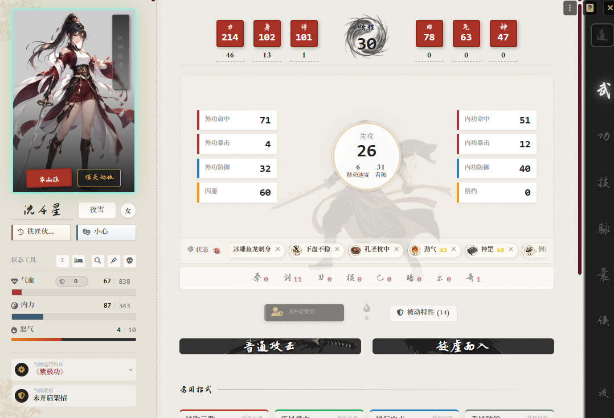
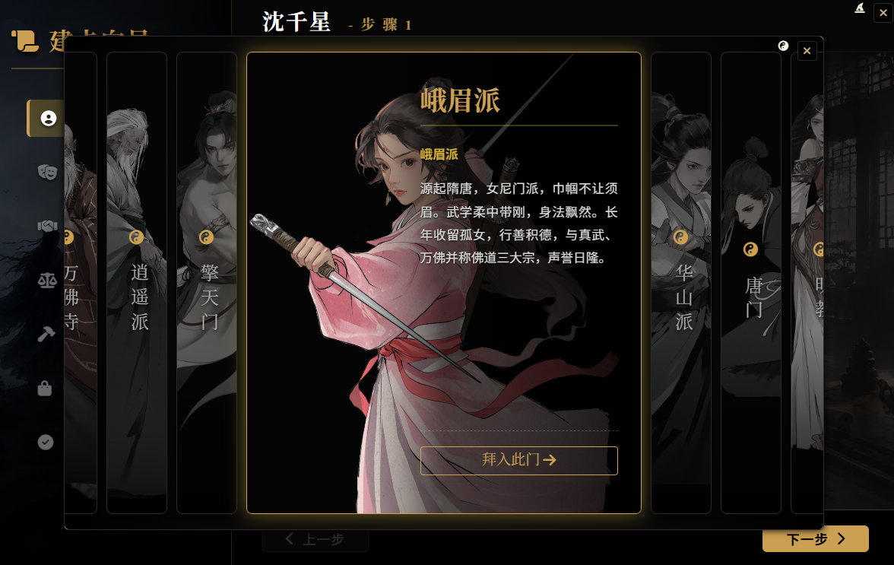
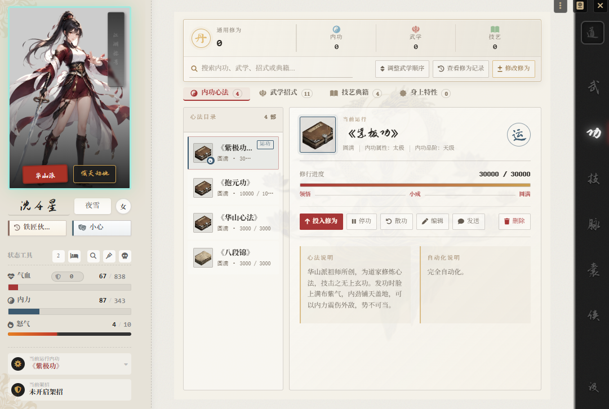
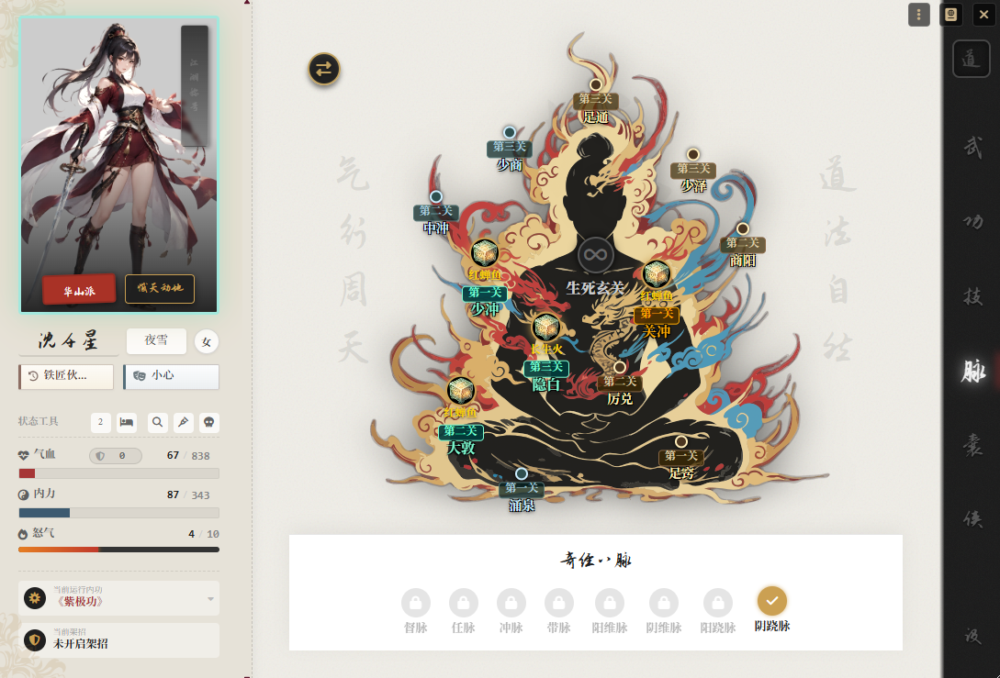
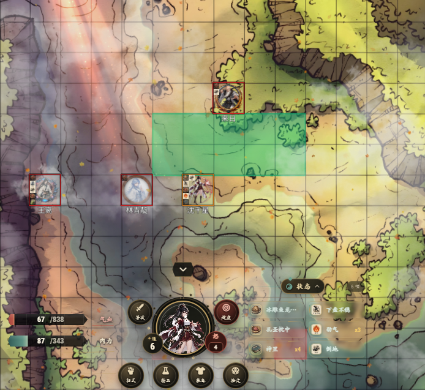
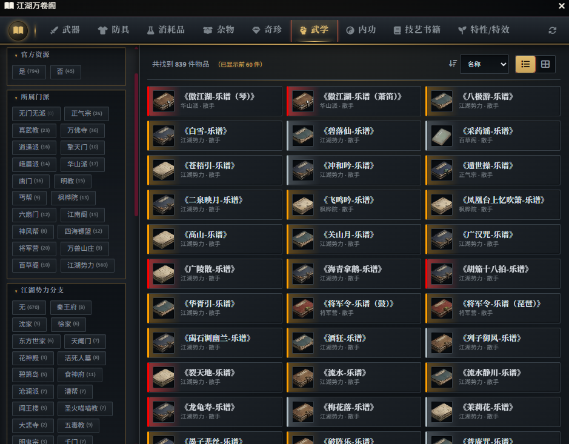
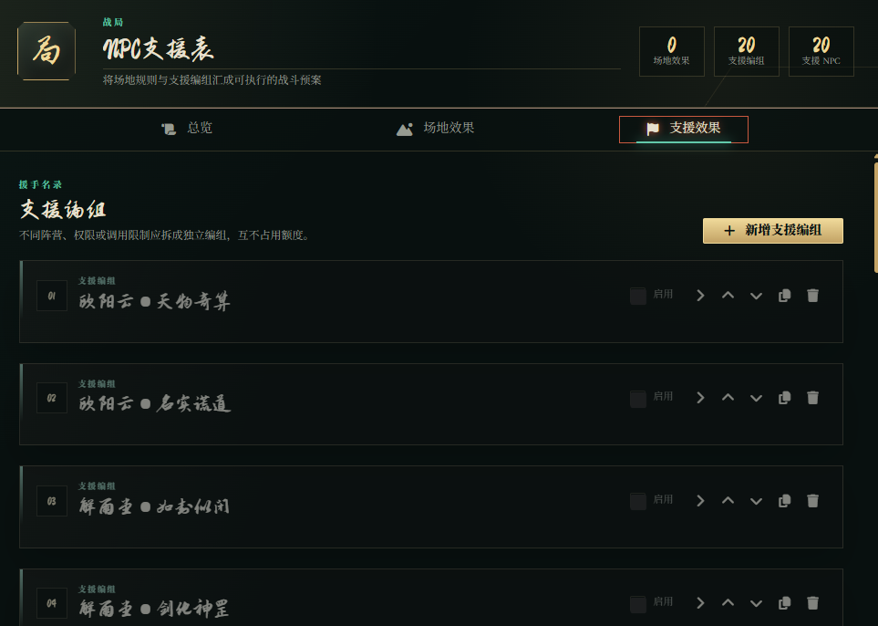
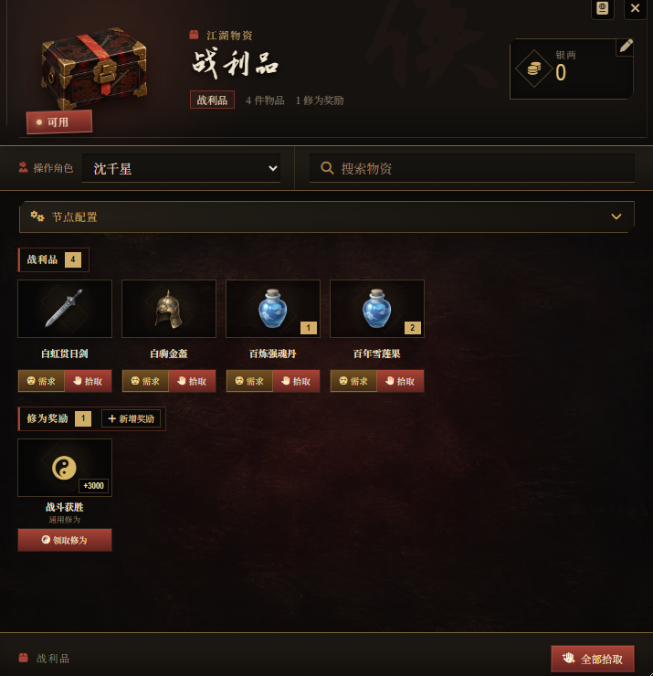

# 侠界之旅系统


[](LICENSE)

面向 Foundry VTT V13 的《侠界之旅》游戏系统，提供角色成长、战斗流程、特效自动化、规则书资源和战局管理等功能。

**设计、开发与维护：[Tiwelee](https://github.com/wdilb)**· [](https://wpa.qq.com/msgrd?v=3&uin=273437679&site=qq&menu=yes)

> [](https://qm.qq.com/q/mJfeP61BwQ)
> [](https://qm.qq.com/q/GOBpPre68q)

<p align="center">
  
</p>

## 项目信息

| 项目 | 说明 |
|---|---|
| Foundry VTT | 最低版本 13，已验证版本 13 |
| 系统 ID | `xjzl-system` |
| 界面语言 | 简体中文 |
| 必需模组 | [socketlib](https://github.com/manuelVo/foundryvtt-socketlib) |
| 当前版本 | 见 [`system.json`](system.json) 或 [Releases](https://github.com/wdilb/fvtt-system-xjzl-system/releases) |

系统仅针对 Foundry VTT V13 进行开发和验证。玩家使用权限代理、物资交易及部分自动结算功能时，需要至少一名 GM 在线。

## 主要功能

- **角色与成长**：支持玩家角色、NPC、野兽角色卡，以及修为投入、内功境界、武学招式、技艺和经脉成长。
- **建卡向导**：引导完成角色基础信息、身世、性格、门派、属性及初始资源配置。
- **武学战斗**：处理实招、虚招、气招、架招、命中、看破、格挡、防御、伤害、治疗和濒死结算。
- **状态与场景工具**：提供 Active Effect 管理、状态叠层、范围效果、通用伤害与治疗工具，以及可选的 1-2-2-2 方格移动规则。
- **江湖万卷阁**：集中浏览和筛选系统合集，并支持按条件随机抽取内容。
- **战局与战斗记录**：支持场地效果、支援 NPC、回合触发、战斗统计、动作记录和战斗评分。
- **物资节点**：可创建战利品、队伍仓库和商铺，处理库存、银两、修为奖励、隐藏掉落与需求投骰。
- **脚本扩展**：GM 和内容作者可以为物品、招式、特性及 Active Effect 编写事件脚本。

## 界面预览

以下截图来自当前版本，按常见使用流程分组展示系统界面。

### 角色创建与成长

从建卡向导开始，完成角色背景、门派、内功、武学和经脉成长。

#### 建卡向导



#### 内功与修为



#### 经脉与穴位



### 战斗与场景

展示角色如何在棋盘场景中移动、选取目标并完成战斗操作。

#### 战斗场景



### 合集、战局与物资

展示 GM 使用频率较高的内容管理工具。

#### 江湖万卷阁



#### 战局配置



#### 战利品物资节点



## 安装

### 使用 Manifest URL 安装

这是推荐的安装方式，Foundry 可以据此检查后续更新。

1. 打开 Foundry VTT 的 **Setup** 页面，进入 **Game Systems**。
2. 点击 **Install System**。
3. 将以下地址粘贴到 **Manifest URL** 输入框并确认安装：

   ```text
   https://raw.githubusercontent.com/wdilb/fvtt-system-xjzl-system/master/system.json
   ```

4. 创建或进入世界前，确认必需模组 `socketlib` 已安装并启用。

<details>
<summary>手动安装发布包</summary>

1. 打开项目的 [Releases](https://github.com/wdilb/fvtt-system-xjzl-system/releases) 页面。
2. 下载最新发布版本中的 `xjzl-system.zip`。
3. 解压后确认系统目录名为 `xjzl-system`。
4. 将目录放入 Foundry 用户数据目录下的 `Data/systems/`。
5. 重启 Foundry VTT。

</details>

<details>
<summary>安装 master 分支源码</summary>

源码安装仅适合测试尚未发布的改动。

1. 下载仓库的 `master` 分支源码。
2. 将解压后的目录重命名为 `xjzl-system`。
3. 将目录放入 Foundry 用户数据目录下的 `Data/systems/`。
4. 重启 Foundry VTT。

</details>

## 快速开始

1. 使用本系统创建一个 Foundry 世界，并确认 `socketlib` 已启用。
2. 新建 `character` 类型的 Actor。建议对空白角色使用标题栏中的 **建卡向导**；完成向导会重置该角色已有的物品和数据。
3. 从合集目录打开 **江湖万卷阁**，浏览或拖入内功、武学、装备及其他系统内容。
4. 多人游戏时保持一名 GM 在线，以便处理权限代理、玩家结算和物资节点事务。

NPC、野兽、物资节点和战局可通过对应的 Actor 或 Item 类型直接创建。

## 脚本扩展

系统脚本是带有上下文变量的可信 JavaScript，不是用于运行不可信代码的安全沙盒。脚本可以参与派生值计算、攻击、防御、资源变化和战斗回合等流程。

下面的 `hit` 脚本会在攻击命中后向目标添加“点穴”状态：

```javascript
if (!args.isHit || !args.target) return;

await game.xjzl.api.effects.addEffect(args.target, "dianxue");
```

编写脚本前请阅读[脚本引擎手册](docs/SCRIPT_ENGINE.md)。手册记录了触发器、上下文字段、执行顺序、公共结算 API 和安全限制；README 不重复维护完整 API。

## 数据质量说明

因规则书资源过多，完全依靠我个人手动录入将耗费大量时间，故合集包数据由 AI 辅助转换和录入。虽然数据会持续修正，但仍可能存在数值错误、字段遗漏、格式异常或描述偏差。跑团时请以规则原文为准；发现问题后可通过 [GitHub Issues](https://github.com/wdilb/fvtt-system-xjzl-system/issues) 或通过 [](https://qm.qq.com/q/GOBpPre68q) 反馈。

提交问题时，建议附上 Foundry 版本、系统版本、复现步骤，以及浏览器控制台中的 `XJZL |` 日志。

## 联系与反馈

- GitHub Issues：[问题与功能建议](https://github.com/wdilb/fvtt-system-xjzl-system/issues)
*   [](https://qm.qq.com/q/mJfeP61BwQ)
*   [](https://qm.qq.com/q/GOBpPre68q)

## 致谢

感谢一气长虹与安迪亚在项目开发期间的关注、交流与测试。

## 许可与素材

项目代码采用 [MIT License](LICENSE)。规则内容、合集数据及第三方素材不因代码使用 MIT License 而自动变更其原有权利或许可条件。

系统内大部分图像素材由 AI 生成，其他图像素材由《侠界之旅》官方提供。合集抽取演出使用的音频及其许可信息见 [`assets/sounds/compendium-draw/SOURCES.md`](assets/sounds/compendium-draw/SOURCES.md)。
